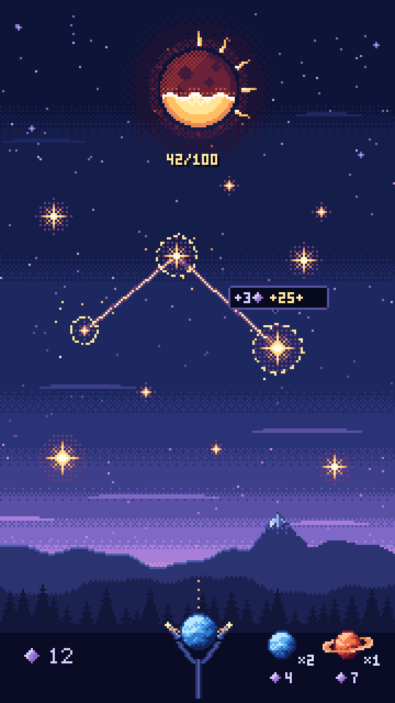

# Dust In Space

Portrait pixel-art mobile game in Godot 4. The player launches celestial packs, links stars, and restores light to a dying Sun.

- Design: [docs/design.md](docs/design.md)
- Art direction: [docs/art-direction.md](docs/art-direction.md)
- Agent instructions: [AGENTS.md](AGENTS.md)
- Balance: `game/config/balance.json`. Check changes with `python tools/balance/sim.py`.

## Setup
1. Install Godot 4 (latest stable) and open `project.godot`.
2. Install **GUT** from the AssetLib for tests.
3. Load `assets/palettes/stellar_sun.gpl` into Aseprite for art.
