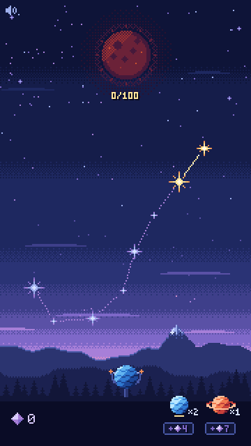

# Dust In Space

**Launch planets. Link stars. Bring light back to the night.**

Dust In Space is a portrait pixel-art game built with **Godot 4.7 and GDScript**. Slingshot planet-shaped packs into the sky, combine the stars they release, and turn your rewards into the next launch. A rare **Big Bang** clears the sky for a large dust payout.

## See the loop



*22 seconds of real gameplay from an earlier Scorpio prototype, looping without sound (305 KiB). The core actions are shown here; constellation visuals, reach limits and Sun tuning have changed since this recording. [Media notes](docs/media/README.md).*

## How to play

1. **Launch:** pull a planet back in the slingshot and release to aim its burst into the sky. Aim changes where stars land; their contents are random.
2. **Link:** tap three stars one at a time, or drag through them. Match **three of the same size**, or **one small, one medium and one big** in any order. Invalid combinations spend nothing.
3. **Collect:** dust flies to the counter and light flows into the Sun. Triples favour dust; mixed-size combinations give more light.
4. **Buy and repeat:** tap the **+◆cost button** beneath a planet to buy another pack, even if you already own some. Tap an owned planet's **icon** to load it for free; with none owned, that icon buys the first pack if you can afford it.

Use a finger on touch screens or the left mouse button on desktop. The speaker in the top-left cycles **on → low → mute** and remembers your choice. A run ends when no packs, affordable purchases or valid links remain.

### Current playtest: Scorpio

The default build enables the **Scorpio constellation prototype**. Light every landmark to win: include **one unlit landmark and two sky stars** in a valid combination. Each step of the link must stay within the displayed reach. Aim packs near the landmark you want to light.

Filling the Sun lights another landmark and clears the remaining sky stars for dust, then resets its light. In this mode, filling the Sun alone does not win.

For the original **Restore the Sun** mode, set `scorpio.enabled` to `false` in [balance.json](game/config/balance.json) before starting a run. In that mode, restore the Sun to win. See the [design document](docs/design.md) for the complete rules and prototype details.

## Run locally

1. Clone this repository and open `project.godot` in **Godot 4.7 (stable)**.
2. Let the editor import the assets, then press **F6** to run an open scene or **F5** to run the game.
3. Play with the mouse, or use touch on a mobile build. The game renders on a **180 × 320** pixel grid with integer scaling and nearest filtering.

With `godot` on your PATH, you can also launch from the repository root:

```sh
godot --path .
```

Sound effects and artwork are included. **GUT 9.7.1** is vendored in `addons/gut`; no separate test-plugin install is needed. Python 3 is only needed for the balance simulator and asset generators. For art work, load `assets/palettes/stellar_sun.gpl` into Aseprite.

## Development checks

Run these from the repository root:

```sh
# Import assets and check startup
godot --headless --path . --import
godot --headless --path . --quit

# Run the GUT suite
godot --headless --path . -s addons/gut/gut_cmdln.gd -gdir=res://tests -gexit

# Simulate balance (Python 3, no dependencies)
python tools/balance/sim.py
```

All costs, chances, rewards and targets live in [game/config/balance.json](game/config/balance.json). Gameplay rules live in `game/core/`; scenes, UI and effects present those rules. Check [AGENTS.md](AGENTS.md) before contributing for branch conventions, testing requirements and the palette/pixel-grid constraints.

## Project guide

| Reference | What it covers |
| --- | --- |
| [Game design](docs/design.md) | Core loop, combos, Scorpio, win/loss and sound |
| [Art direction](docs/art-direction.md) | Palette, pixel grid, sprites and UI |
| [Contributor instructions](AGENTS.md) | Repository layout, workflow and checks |
| [Balance configuration](game/config/balance.json) | Shared tuning for the game and simulator |
| [Issues](https://github.com/mrafael1/DustInSpace/issues) | Bugs, experiments and planned work |

The project is a playable prototype. Scorpio is being playtested; music and longer-term progression are outside the current core loop.
